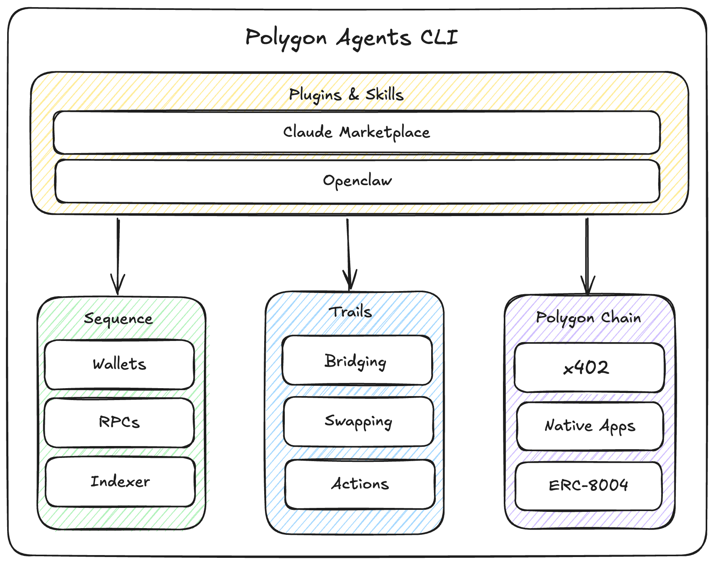

# Polygon Agent CLI

<p align="center">
  
</p>

Monorepo for the Polygon Agent CLI — everything AI agents need to operate onchain.

## Polygon Agent CLI

You're probably looking for the CLI. Head to the package for full documentation:

**[`packages/polygon-agent-cli/`](packages/polygon-agent-cli/)** — `@polygonlabs/agent-cli` on npm

Install on your agent:

```bash
npx skills add https://github.com/0xPolygon/polygon-agent-cli
```

Or install the CLI directly:

```bash
npx @polygonlabs/agent-cli --help
```

## Other Packages

This repository also contains supporting packages:

- **[`packages/agentconnect-ui/`](packages/agentconnect-ui/)** — React app (served at `agentconnect.polygon.technology`) that the CLI opens for browser-based wallet login with Google or email
- **[`packages/oidc-relay/`](packages/oidc-relay/)** — Cloudflare Worker that pairs the login page with the CLI during browser login

## Development

```bash
pnpm install
pnpm polygon-agent --help
```

Requirements: Node.js 20+, pnpm

## License

MIT
